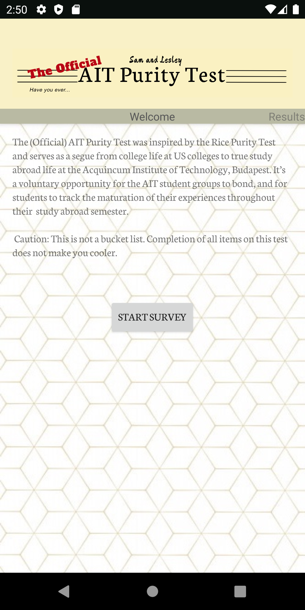

# AITPurityTest

# What is this?

We are creating an interactive mobile app that scores then analyzes a student's AIT (Acquincum Institute of Technology) Study Abroad Experience. This app was inspired by the Rice Purity Test. The questions are modified to be specific to AIT students who have studied abroad spring 2020.

# What features do we have?

1. Interactive survey using Quick Bird Studios
2. Results page that compares your score against everyone else's score
3. Encryption of sensitive data to protect users' privacy

# Extensions

We hope to add further question-based analysis.

_Last edited: May 12, 2020_
